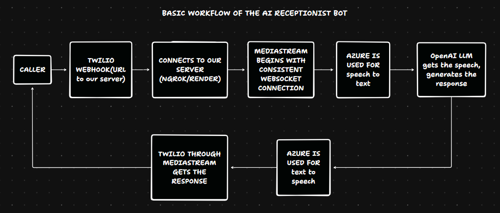
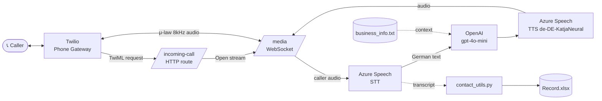

Overview:
---------



# AI Receptionist — Overview & Local Setup

A German-language AI voice receptionist for **KFZ-Meisterbetrieb Schwabing Provenzano GmbH**, a car workshop in Munich. It answers inbound phone calls and handles **appointment booking, FAQs, and light technical intake**. Runs as an async Quart app, deployed on **Azure App Service** in production or **locally via ngrok** in development.

Repo: [Deepvertise-tech/AI_receptionist](https://github.com/Deepvertise-tech/AI_receptionist)

---

## 1. How the bot is structured

### Internal modules (files in the repo)

| File | Role |
|---|---|
| `ai_receptionist.py` | Main app (~1000 lines). Quart server exposing `/incoming-call` (HTTP) and `/media` (WebSocket). Orchestrates the full conversation: Twilio handshake, audio in, STT, LLM, TTS, audio out. |
| `contact_utils.py` | Helpers for extracting caller name and phone number from transcribed speech. *(Note: some logic duplicates the main file — flagged for cleanup.)* |
| `business_info.txt` | Knowledge base — hours, services, prices, FAQ answers. Injected into the LLM system prompt. |
| `Record.xlsx` | Captured leads (name, phone, time). Written via `openpyxl`. |
| `.env` | Secrets and config — Twilio, Azure Speech, OpenAI keys, plus `MEDIA_WS_URL` (changes per ngrok session). |
| `requirements.txt` | Python dependencies. |
| `startup.txt` | Azure App Service startup command. |
| `version.txt` | Version stamp. |

### External services involved

- **Twilio (phone gateway)** — Caller dials the Twilio number; Twilio HTTP-POSTs to `/incoming-call` and Quart returns TwiML that tells Twilio to open a Media Stream.
- **Twilio Media Streams (WebSocket)** — μ-law 8 kHz audio flows both directions on `/media`.
- **Azure Speech STT** — caller audio → German text.
- **OpenAI `gpt-4o-mini`** (streaming) — text + `business_info.txt` context + history → response text.
- **Azure Speech TTS (`de-DE-KatjaNeural`)** — response text → audio → back through the same WebSocket → caller.
- **openpyxl** — when name/phone get detected, append a row to `Record.xlsx`.

### End-to-end flow of one call



---

## 2. How to run it locally

### Step 1 — Clone the repo (main is the working branch)

```bash
git clone https://github.com/Deepvertise-tech/AI_receptionist.git
cd AI_receptionist
git pull origin main
```

### Step 2 — Create and activate a virtual environment

Open the project in **Cursor** or **VS Code**, then in the integrated terminal:

```powershell
python -m venv .venv
.\.venv\Scripts\Activate.ps1      # Windows PowerShell
# source .venv/bin/activate       # macOS / Linux
```

> ⚠️ Don't rename or move the project folder after creating the venv — Windows venvs hardcode absolute paths into the `.exe` shims and they will break.

### Step 3 — Install base requirements

```bash
pip install -r requirements.txt
```

### Step 4 — Pin the version-sensitive dependencies

Azure has these baked into its environment; locally we must match them explicitly to avoid runtime conflicts:

```bash
pip install google-auth==2.22.0
pip install google-auth-oauthlib==1.0.0
pip install google-auth-httplib2==0.1.0
pip install google-api-python-client==2.95.0
pip install openai==0.28.0
pip install gunicorn==21.2.0
pip uninstall openai aiohttp typing-extensions -y
pip install openai==0.28 aiohttp==3.7.4 typing-extensions==4.5.0
```

### Step 5 — Drop in the `.env` file

Get it from the shared Google Drive (**"Files needed for local execution"**) and place it in the project root. It contains the Twilio, Azure, and OpenAI credentials.

### Step 6 — Set up ngrok

1. Download from <https://ngrok.com/download>, unzip, place `ngrok.exe` in the project folder.
2. In a **new** terminal, run:
   ```bash
   ngrok http 5000
   ```
3. Copy the forwarding subdomain (e.g. `bfe4-79-196-20-231.ngrok-free.app`) — **without** the `https://` prefix.

### Step 7 — Update `MEDIA_WS_URL` in `.env`

Paste the subdomain between `wss://` and `/media`:

```properties
MEDIA_WS_URL=wss://bfe4-79-196-20-231.ngrok-free.app/media
```

### Step 8 — Update the Twilio webhook

Log in to [Twilio Console](https://console.twilio.com) with `info@expatlaunch.de` → **Phone Numbers** → edit the **"A call comes in"** webhook to:

```
https://<your-ngrok-subdomain>/incoming-call
```

Method: **HTTP POST**. Save.

### Step 9 — Run the app

In **another** terminal (venv activated):

```bash
python -m hypercorn --bind 0.0.0.0:5000 ai_receptionist:app
```

Keep **both** terminals running — the ngrok one and the hypercorn one.

### Step 10 — Test

Call the Twilio number from your phone. Watch the logs scroll in the hypercorn terminal.

🎉 **You're live locally.**

---

## Quick troubleshooting

| Symptom | Likely cause |
|---|---|
| `'uvicorn' / 'hypercorn' is not recognized` or "Unable to create process using ... python.exe" | Venv was created in a different folder path. Delete `.venv`, recreate it in the current location, reinstall requirements. |
| Twilio call connects then drops immediately | `MEDIA_WS_URL` in `.env` doesn't match the current ngrok subdomain (it changes every restart on the free tier). |
| `ModuleNotFoundError` on import | Forgot to activate the venv, or skipped Step 4 pinning. |
| Webhook returns 502 in Twilio logs | Hypercorn isn't running, or it's bound to a different port than `ngrok http 5000`. |
